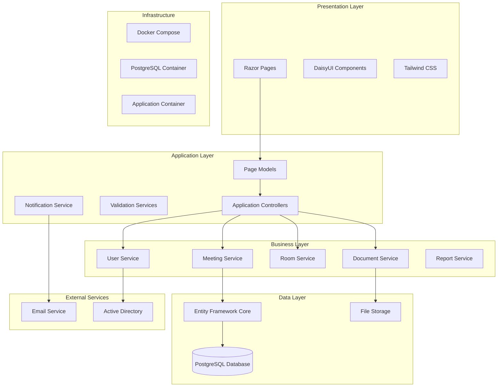
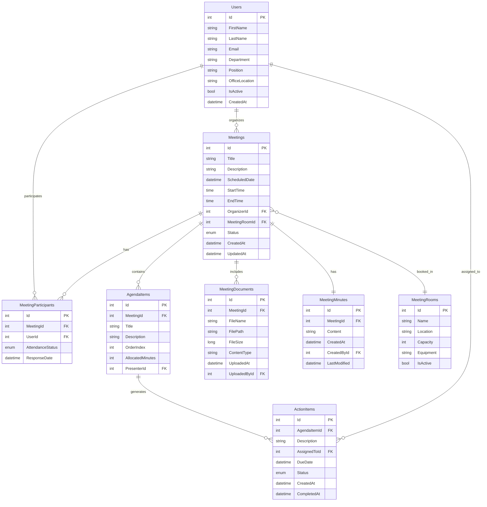

# Meeting Management System Design Document

## Overview

The Meeting Management System (MMS) is a web-based application built using ASP.NET Core with Razor Pages frontend, designed specifically for Nepali government offices. The system provides comprehensive meeting coordination, scheduling, documentation, and resource management capabilities while maintaining security and compliance with government protocols.

### Technology Stack

- **Backend Framework**: ASP.NET Core 9.0 (Latest)
- **Frontend**: Razor Pages with server-side rendering
- **UI Framework**: DaisyUI (via CDN) with Tailwind CSS
- **Database**: PostgreSQL 16 with Entity Framework Core
- **Containerization**: Docker Compose for development and deployment
- **Authentication**: ASP.NET Core Identity
- **File Storage**: Local file system with configurable cloud storage support
- **Email Service**: SMTP with configurable providers
- **Logging**: Serilog with structured logging

### Key Design Principles

- **Government-First Design**: Tailored specifically for Nepali government office workflows
- **Security by Design**: Role-based access control and audit logging
- **Responsive Design**: Mobile-friendly interface using DaisyUI components
- **Scalability**: Modular architecture supporting multiple departments
- **Maintainability**: Clean architecture with separation of concerns

## Architecture

### High-Level Architecture



### Project Structure

```
MeetingManagementSystem/
├── src/
│   ├── MeetingManagementSystem.Web/          # Razor Pages Application
│   │   ├── Pages/                            # Razor Pages
│   │   ├── Models/                           # View Models & DTOs
│   │   ├── Services/                         # Application Services
│   │   ├── wwwroot/                          # Static files
│   │   └── Program.cs                        # Application entry point
│   ├── MeetingManagementSystem.Core/         # Business Logic
│   │   ├── Entities/                         # Domain Models
│   │   ├── Interfaces/                       # Service Contracts
│   │   ├── Services/                         # Business Services
│   │   └── Enums/                           # System Enumerations
│   └── MeetingManagementSystem.Infrastructure/ # Data & External Services
│       ├── Data/                             # EF Core Context & Repositories
│       ├── Services/                         # External Service Implementations
│       └── Migrations/                       # Database Migrations
└── tests/                                    # Unit & Integration Tests
```

## Components and Interfaces

### Core Entities

#### Meeting Entity
```csharp
public class Meeting
{
    public int Id { get; set; }
    public string Title { get; set; }
    public string Description { get; set; }
    public DateTime ScheduledDate { get; set; }
    public TimeSpan StartTime { get; set; }
    public TimeSpan EndTime { get; set; }
    public int OrganizerId { get; set; }
    public int? MeetingRoomId { get; set; }
    public MeetingStatus Status { get; set; }
    public DateTime CreatedAt { get; set; }
    public DateTime UpdatedAt { get; set; }
    
    // Navigation Properties
    public User Organizer { get; set; }
    public MeetingRoom MeetingRoom { get; set; }
    public ICollection<MeetingParticipant> Participants { get; set; }
    public ICollection<AgendaItem> AgendaItems { get; set; }
    public ICollection<MeetingDocument> Documents { get; set; }
    public MeetingMinutes Minutes { get; set; }
}
```

#### User Entity
```csharp
public class User : IdentityUser<int>
{
    public string FirstName { get; set; }
    public string LastName { get; set; }
    public string Department { get; set; }
    public string Position { get; set; }
    public string OfficeLocation { get; set; }
    public bool IsActive { get; set; }
    public DateTime CreatedAt { get; set; }
    
    // Navigation Properties
    public ICollection<Meeting> OrganizedMeetings { get; set; }
    public ICollection<MeetingParticipant> MeetingParticipations { get; set; }
}
```

#### MeetingRoom Entity
```csharp
public class MeetingRoom
{
    public int Id { get; set; }
    public string Name { get; set; }
    public string Location { get; set; }
    public int Capacity { get; set; }
    public string Equipment { get; set; }
    public bool IsActive { get; set; }
    
    // Navigation Properties
    public ICollection<Meeting> Meetings { get; set; }
}
```

### Service Interfaces

#### IMeetingService
```csharp
public interface IMeetingService
{
    Task<Meeting> CreateMeetingAsync(CreateMeetingDto dto);
    Task<Meeting> GetMeetingByIdAsync(int id);
    Task<IEnumerable<Meeting>> GetMeetingsByDateRangeAsync(DateTime start, DateTime end);
    Task<Meeting> UpdateMeetingAsync(int id, UpdateMeetingDto dto);
    Task<bool> CancelMeetingAsync(int id, string reason);
    Task<IEnumerable<Meeting>> GetUserMeetingsAsync(int userId);
}
```

#### INotificationService
```csharp
public interface INotificationService
{
    Task SendMeetingInvitationAsync(Meeting meeting, IEnumerable<User> participants);
    Task SendMeetingReminderAsync(Meeting meeting, TimeSpan reminderTime);
    Task SendMeetingCancellationAsync(Meeting meeting, string reason);
    Task SendActionItemReminderAsync(ActionItem actionItem);
}
```

### Page Models Architecture

#### Base Page Model
```csharp
public abstract class BasePageModel : PageModel
{
    protected readonly ILogger Logger;
    protected readonly INotificationService NotificationService;
    
    protected BasePageModel(ILogger logger, INotificationService notificationService)
    {
        Logger = logger;
        NotificationService = notificationService;
    }
    
    protected void SetSuccessMessage(string message)
    {
        TempData["SuccessMessage"] = message;
    }
    
    protected void SetErrorMessage(string message)
    {
        TempData["ErrorMessage"] = message;
    }
}
```

## Data Models

### Database Schema Design



### Configuration Models

#### MeetingSettings
```csharp
public class MeetingSettings
{
    public int DefaultMeetingDurationMinutes { get; set; } = 60;
    public int ReminderHours { get; set; } = 24;
    public int MaxParticipants { get; set; } = 50;
    public int MaxDocumentSizeMB { get; set; } = 10;
    public string[] AllowedFileTypes { get; set; } = { ".pdf", ".doc", ".docx", ".xls", ".xlsx" };
}
```

## Error Handling

### Exception Handling Strategy

#### Custom Exception Types
```csharp
public class MeetingNotFoundException : Exception
{
    public MeetingNotFoundException(int meetingId) 
        : base($"Meeting with ID {meetingId} was not found.") { }
}

public class RoomNotAvailableException : Exception
{
    public RoomNotAvailableException(int roomId, DateTime date, TimeSpan time)
        : base($"Room {roomId} is not available on {date:yyyy-MM-dd} at {time}.") { }
}

public class UnauthorizedMeetingAccessException : Exception
{
    public UnauthorizedMeetingAccessException(int userId, int meetingId)
        : base($"User {userId} is not authorized to access meeting {meetingId}.") { }
}
```

#### Global Error Handling
```csharp
public class GlobalExceptionMiddleware
{
    private readonly RequestDelegate _next;
    private readonly ILogger<GlobalExceptionMiddleware> _logger;

    public async Task InvokeAsync(HttpContext context)
    {
        try
        {
            await _next(context);
        }
        catch (Exception ex)
        {
            _logger.LogError(ex, "An unhandled exception occurred");
            await HandleExceptionAsync(context, ex);
        }
    }

    private static async Task HandleExceptionAsync(HttpContext context, Exception exception)
    {
        context.Response.StatusCode = exception switch
        {
            MeetingNotFoundException => 404,
            UnauthorizedMeetingAccessException => 403,
            RoomNotAvailableException => 409,
            _ => 500
        };

        var response = new
        {
            error = exception.Message,
            statusCode = context.Response.StatusCode
        };

        await context.Response.WriteAsync(JsonSerializer.Serialize(response));
    }
}
```

## Testing Strategy

### Testing Pyramid

#### Unit Tests
- **Service Layer Tests**: Business logic validation
- **Repository Tests**: Data access layer testing
- **Validation Tests**: Input validation and business rules
- **Utility Tests**: Helper functions and extensions

#### Integration Tests
- **Database Integration**: Entity Framework operations
- **Email Service Integration**: Notification delivery
- **Authentication Integration**: Identity system testing
- **File Upload Integration**: Document management testing

#### End-to-End Tests
- **Meeting Creation Workflow**: Complete meeting lifecycle
- **User Authentication Flow**: Login and authorization
- **Notification Delivery**: Email and system notifications
- **Report Generation**: Data export and reporting

### Test Data Strategy
```csharp
public class TestDataBuilder
{
    public static Meeting CreateTestMeeting(string title = "Test Meeting")
    {
        return new Meeting
        {
            Title = title,
            Description = "Test meeting description",
            ScheduledDate = DateTime.Today.AddDays(1),
            StartTime = new TimeSpan(10, 0, 0),
            EndTime = new TimeSpan(11, 0, 0),
            Status = MeetingStatus.Scheduled
        };
    }
    
    public static User CreateTestUser(string email = "test@gov.np")
    {
        return new User
        {
            FirstName = "Test",
            LastName = "User",
            Email = email,
            Department = "IT Department",
            Position = "Officer",
            IsActive = true
        };
    }
}
```

## Security Considerations

### Authentication & Authorization
- **ASP.NET Core Identity**: User management and authentication
- **Role-Based Access Control**: Government official, participant, and admin roles
- **JWT Tokens**: For API authentication (if needed)
- **Password Policies**: Strong password requirements
- **Account Lockout**: Protection against brute force attacks

### Data Protection
- **Data Encryption**: Sensitive data encryption at rest
- **HTTPS Enforcement**: All communications over secure channels
- **Input Validation**: Comprehensive input sanitization
- **SQL Injection Prevention**: Parameterized queries via EF Core
- **XSS Protection**: Output encoding and CSP headers

### Audit Logging
```csharp
public class AuditLog
{
    public int Id { get; set; }
    public string Action { get; set; }
    public string EntityType { get; set; }
    public int EntityId { get; set; }
    public int UserId { get; set; }
    public DateTime Timestamp { get; set; }
    public string Changes { get; set; }
    public string IpAddress { get; set; }
}
```

## Performance Considerations

### Database Optimization
- **PostgreSQL Features**: Leveraging advanced PostgreSQL features like JSONB, full-text search
- **Indexing Strategy**: Optimized B-tree and GIN indexes for common queries
- **Query Optimization**: Efficient LINQ queries with proper includes and PostgreSQL-specific optimizations
- **Connection Pooling**: Npgsql connection pooling with Docker networking
- **Caching Strategy**: Memory caching for frequently accessed data with Redis support

### Frontend Performance
- **CDN Usage**: DaisyUI and Tailwind CSS via CDN
- **Image Optimization**: Compressed images and proper formats
- **Lazy Loading**: Deferred loading of non-critical resources
- **Minification**: CSS and JavaScript minification in production

### Scalability Features
- **Pagination**: Large dataset handling with efficient pagination
- **Background Jobs**: Asynchronous processing for notifications
- **File Storage**: Configurable storage providers (local/cloud)
- **Database Sharding**: Preparation for horizontal scaling

## Deployment Architecture

### Environment Configuration
- **Development**: Docker Compose with PostgreSQL container, local file storage, MailHog for email testing
- **Staging**: Docker Compose with managed PostgreSQL, Azure Blob Storage, SendGrid
- **Production**: Kubernetes with PostgreSQL cluster, redundant storage, enterprise SMTP

### Docker Compose Configuration
```yaml
version: '3.8'
services:
  postgres:
    image: postgres:16
    environment:
      POSTGRES_DB: meetingmanagement
      POSTGRES_USER: postgres
      POSTGRES_PASSWORD: postgres
    ports:
      - "5432:5432"
    volumes:
      - postgres_data:/var/lib/postgresql/data
    networks:
      - meeting-network

  app:
    build: .
    ports:
      - "5000:5000"
    depends_on:
      - postgres
    environment:
      - ConnectionStrings__DefaultConnection=Host=postgres;Database=meetingmanagement;Username=postgres;Password=postgres
    networks:
      - meeting-network

  mailhog:
    image: mailhog/mailhog
    ports:
      - "1025:1025"
      - "8025:8025"
    networks:
      - meeting-network

volumes:
  postgres_data:

networks:
  meeting-network:
    driver: bridge
```

### Configuration Management
```json
{
  "ConnectionStrings": {
    "DefaultConnection": "Host=localhost;Database=meetingmanagement;Username=postgres;Password=postgres"
  },
  "MeetingSettings": {
    "DefaultMeetingDurationMinutes": 60,
    "ReminderHours": 24,
    "MaxParticipants": 50,
    "MaxDocumentSizeMB": 10
  },
  "EmailSettings": {
    "SmtpServer": "mailhog",
    "SmtpPort": 1025,
    "EnableSsl": false,
    "FromAddress": "meetings@gov.np"
  }
}
```

## Docker Configuration

### Dockerfile
```dockerfile
FROM mcr.microsoft.com/dotnet/aspnet:9.0 AS base
WORKDIR /app
EXPOSE 5000

FROM mcr.microsoft.com/dotnet/sdk:9.0 AS build
WORKDIR /src
COPY ["src/MeetingManagementSystem.Web/MeetingManagementSystem.Web.csproj", "src/MeetingManagementSystem.Web/"]
COPY ["src/MeetingManagementSystem.Core/MeetingManagementSystem.Core.csproj", "src/MeetingManagementSystem.Core/"]
COPY ["src/MeetingManagementSystem.Infrastructure/MeetingManagementSystem.Infrastructure.csproj", "src/MeetingManagementSystem.Infrastructure/"]
RUN dotnet restore "src/MeetingManagementSystem.Web/MeetingManagementSystem.Web.csproj"
COPY . .
WORKDIR "/src/src/MeetingManagementSystem.Web"
RUN dotnet build "MeetingManagementSystem.Web.csproj" -c Release -o /app/build

FROM build AS publish
RUN dotnet publish "MeetingManagementSystem.Web.csproj" -c Release -o /app/publish

FROM base AS final
WORKDIR /app
COPY --from=publish /app/publish .
ENTRYPOINT ["dotnet", "MeetingManagementSystem.Web.dll"]
```

### PostgreSQL Specific Configurations

#### Entity Framework Configuration
```csharp
// Program.cs
builder.Services.AddDbContext<ApplicationDbContext>(options =>
    options.UseNpgsql(builder.Configuration.GetConnectionString("DefaultConnection"),
        npgsqlOptions => npgsqlOptions.EnableRetryOnFailure()));

// ApplicationDbContext.cs
protected override void OnModelCreating(ModelBuilder modelBuilder)
{
    base.OnModelCreating(modelBuilder);
    
    // PostgreSQL specific configurations
    modelBuilder.Entity<Meeting>()
        .HasIndex(m => new { m.ScheduledDate, m.StartTime })
        .HasDatabaseName("IX_Meeting_DateTime");
    
    modelBuilder.Entity<User>()
        .HasIndex(u => u.Email)
        .IsUnique()
        .HasDatabaseName("IX_User_Email");
    
    // Use PostgreSQL JSONB for storing meeting settings
    modelBuilder.Entity<Meeting>()
        .Property(m => m.Settings)
        .HasColumnType("jsonb");
}
```

#### PostgreSQL Extensions
```sql
-- Enable extensions for advanced features
CREATE EXTENSION IF NOT EXISTS "uuid-ossp";
CREATE EXTENSION IF NOT EXISTS "pg_trgm";
CREATE EXTENSION IF NOT EXISTS "unaccent";

-- Full-text search configuration for Nepali content
CREATE TEXT SEARCH CONFIGURATION nepali (COPY = simple);
```

### Development Workflow

#### Quick Start Commands
```bash
# Start the development environment
docker-compose up -d

# Run database migrations
dotnet ef database update --project src/MeetingManagementSystem.Infrastructure

# Stop the environment
docker-compose down

# Reset database (development only)
docker-compose down -v
docker-compose up -d
```

#### Database Management
```bash
# Connect to PostgreSQL container
docker exec -it meetingmanagement_postgres_1 psql -U postgres -d meetingmanagement

# Backup database
docker exec meetingmanagement_postgres_1 pg_dump -U postgres meetingmanagement > backup.sql

# Restore database
docker exec -i meetingmanagement_postgres_1 psql -U postgres meetingmanagement < backup.sql
```